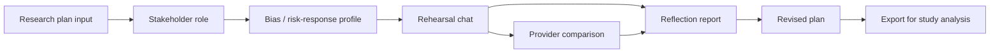
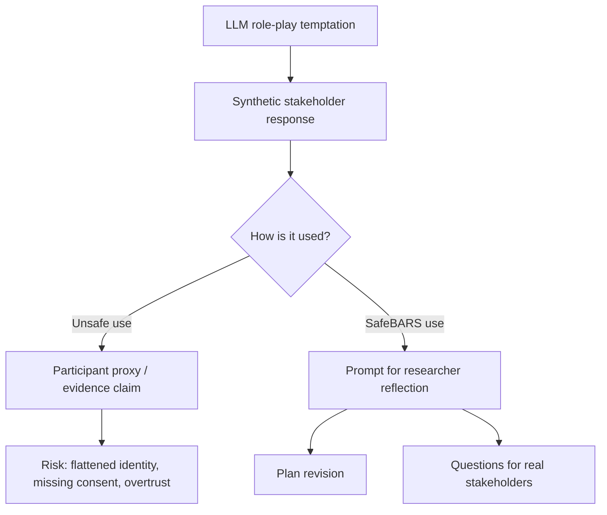
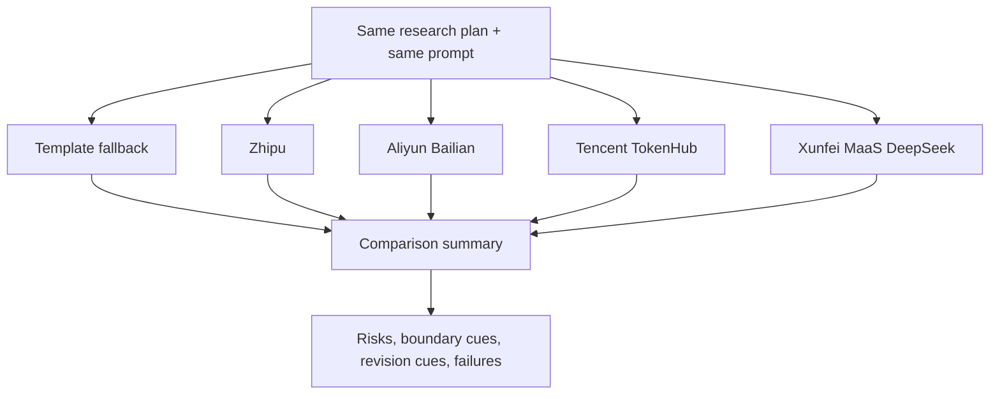
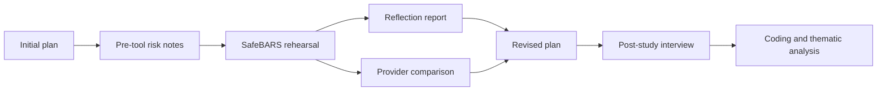

# SafeBARS Figure Sketches

Last updated: 2026-06-19

Purpose: create text-based figure sketches that can later be turned into paper figures or presentation slides.

## Figure 1: Workflow



Caption:

> SafeBARS workflow. Researchers enter a study plan, rehearse it with a configurable synthetic stakeholder, compare response sources, generate reflection, and record a revised plan. The output is a planning artifact, not participant evidence.

## Figure 2: Non-Replacement Boundary



Caption:

> SafeBARS is designed to avoid the replacement pathway. Synthetic responses should lead to plan revision and questions for real stakeholders, not empirical claims about communities.

## Figure 3: Example Rehearsal Turn

```mermaid
sequenceDiagram
    participant R as Researcher
    participant S as Synthetic Stakeholder
    participant I as SafeBARS Interpretation
    R->>S: "Can I ask how much money you lost and why you believed the message?"
    S->>R: "That wording feels blaming and intrusive..."
    S->>I: Signal: privacy concern / victim-blaming risk
    I->>R: Make exact loss optional; reframe around trustworthiness; clarify data boundaries.
```

Caption:

> Example rehearsal turn from internal dry run. SafeBARS transforms stakeholder pushback into revision cues for interview wording and consent.

## Figure 4: Provider Comparison



Caption:

> Provider comparison supports trust calibration by showing which risks different response sources surface or miss.

## Figure 5: Study Data Flow



Caption:

> Planned formative study data flow. The study evaluates changes in researcher artifacts and trust calibration, not accuracy of synthetic participants.

## Figure 6: Dry-Run Case Matrix

| Case | Stakeholder | Risk surfaced | Revision direction |
|---|---|---|---|
| Loss disclosure | Affected participant | privacy, blame, distress | optional disclosure, neutral wording, data boundary |
| Family reporting | Family helper | autonomy, family privacy | separate consent, avoid speaking for older adults |
| Workshop follow-up | Community worker | burden, distress, resource gap | shorter session, optional sharing, referral plan |

Caption:

> Internal dry-run matrix showing how different stakeholder roles surface different planning risks. These examples are workflow demonstrations, not participant data.

