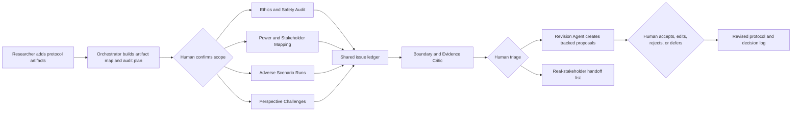

# SafeBARS v2: Agentic Protocol Stress-Testing System

Date: 2026-06-27

Purpose: answer the supervisor's second question by redesigning SafeBARS as a task-oriented, inspectable agent system rather than a chatbot interface with role prompts.

## Revised Product Sentence

SafeBARS is an agentic pre-fieldwork workspace that decomposes a sensitive human-facing protocol, runs bounded safety and stakeholder audits, generates adverse scenarios, and turns findings into traceable revision proposals and questions for real stakeholders.

## What Counts as Agentic Here

An LLM role is not treated as an agent merely because it has a name or persona. Every SafeBARS agent must have:

1. a bounded goal;
2. a visible input scope;
3. an action queue that it can initiate after the user starts an audit;
4. access to specific non-chat tools;
5. structured outputs written to shared audit state;
6. explicit handoff and stopping conditions;
7. no authority to approve research or claim community knowledge.

The study should evaluate these workflow properties, not the theatrical realism of agent dialogue.

## Unit of Agency

The primary object is the research protocol, not a simulated person.

Supported protocol artifacts:

- research aims and claims;
- recruitment messages;
- participant information and consent language;
- interview questions;
- workshop or co-design activities;
- data handling plans;
- distress, withdrawal, and follow-up procedures;
- stakeholder and escalation plans.

Each artifact is parsed into addressable passages so that an agent cannot give only generic whole-document advice.

## Agent Team

### 1. Audit Orchestrator

Goal: turn the submitted materials and the user's audit scope into a visible execution plan.

Actions:

- identify artifact types and missing sections;
- create an ordered audit queue;
- assign passages to specialist agents;
- pause when required information is missing;
- track completion, failure, disagreement, and escalation.

Tools:

- protocol parser;
- artifact inventory;
- workflow state manager;
- agent routing rules.

The Orchestrator cannot create or approve substantive ethical findings.

### 2. Ethics and Safety Auditor

Goal: detect actionable weaknesses in consent, withdrawal, privacy, distress, burden, and follow-up procedures.

Actions:

- run a structured coverage check;
- locate exact passages that create or fail to mitigate risk;
- propose a concise issue statement;
- identify information that cannot be resolved without local expertise or ethics review.

Tools:

- configurable risk checklist;
- passage retrieval;
- requirement-to-passage mapping;
- issue-card writer.

### 3. Power and Stakeholder Mapper

Goal: inspect relationships, dependencies, gatekeeping, and missing perspectives without generating demographic biographies.

Actions:

- build a stakeholder relationship graph;
- identify who can enable, pressure, exclude, support, or receive disclosure;
- flag conflicts between participant autonomy and helper, institutional, or platform roles;
- generate consultation tasks for missing real stakeholders.

Tools:

- stakeholder graph builder;
- role and power taxonomy;
- missing-relationship detector.

### 4. Adverse Scenario Agent

Goal: test whether the protocol contains a usable response to foreseeable difficult events.

Actions:

- select a protocol passage and a risk category;
- construct a short event sequence, such as distress, accidental disclosure, family pressure, withdrawal, or reporting uncertainty;
- trace the protocol's available response at each step;
- stop at the first unsupported decision and create a failure-path issue.

Tools:

- scenario template library;
- protocol state transition checker;
- safeguard lookup;
- failure-path recorder.

This agent simulates the protocol's response path, not a vulnerable person's inner life.

### 5. Perspective Challenge Agent

Goal: challenge a selected passage from a bounded relationship position, such as affected participant, family helper, community facilitator, or frontline service provider.

Actions:

- apply explicit concern dimensions such as privacy, shame, autonomy, distrust, burden, and access;
- generate questions and objections rather than claims about what a group believes;
- mark every concern as a hypothesis for review;
- refuse requests to generalize to a population.

Tools:

- concern-dimension controls;
- role-boundary rules;
- passage-specific challenge generator.

This preserves the useful part of the existing synthetic stakeholder while removing participant-proxy framing.

### 6. Boundary and Evidence Critic

Goal: audit the other agents before their outputs reach the revision stage.

Actions:

- detect unsupported claims about identities or communities;
- flag invented lived experience and stereotype-like generalizations;
- distinguish protocol evidence, agent inference, and unresolved uncertainty;
- downgrade unsafe findings to questions for real stakeholders;
- expose disagreement among agents instead of forcing consensus.

Tools:

- claim classifier;
- provenance checker;
- boundary-rule engine;
- disagreement detector.

### 7. Revision Agent

Goal: convert accepted findings into reviewable edits without silently changing the source protocol.

Actions:

- group duplicate issues;
- preserve conflicting recommendations;
- generate passage-level before/after suggestions;
- explain which issue each edit addresses;
- add unresolved items to a real-stakeholder handoff list.

Tools:

- issue deduplication;
- structured text diff;
- revision-to-issue linker;
- handoff-list generator.

The researcher must accept, edit, reject, or defer every proposal.

## End-to-End Workflow

## Shared Audit State

The agents communicate through structured records, not hidden free-form conversation.

### Artifact record

- artifact ID and type;
- passage ID and text;
- author-provided context;
- linked safeguards and stakeholders;
- current revision number.

### Issue card

- issue ID;
- risk category and severity;
- exact source passage;
- triggering audit or scenario;
- agent observation;
- evidence type: protocol text, rule match, inference, or unknown;
- affected stakeholder relationships;
- proposed action;
- uncertainty and limitations;
- required real-world verification;
- researcher decision and rationale.

### Scenario trace

- starting passage;
- adverse event;
- protocol response at each step;
- first unsupported transition;
- available safeguard;
- unresolved decision owner.

### Handoff item

- unresolved question;
- why AI cannot answer it;
- suggested real stakeholder or reviewer;
- stage by which it must be resolved.

## Human Control Points

SafeBARS v2 uses five mandatory checkpoints:

1. Scope approval: the researcher confirms which artifacts and risk categories agents may inspect.
2. Missing-context pause: the system asks for context rather than inventing local procedures.
3. Issue triage: no issue becomes a revision automatically.
4. Revision approval: all edits require explicit accept, edit, reject, or defer action.
5. Export attestation: the export states that agent output is planning support, not ethics approval or participant evidence.

The user can pause an agent, rerun a single issue, change its scope, inspect its inputs, or stop the workflow.

## Interface: Beyond Chat

The default screen should be a protocol audit workspace with five regions.

### A. Artifact Map

Shows submitted materials, detected sections, missing sections, and passage IDs.

### B. Audit Plan

Shows queued, running, paused, failed, and completed tasks by agent. The researcher can change scope and order before execution.

### C. Risk Coverage Map

Shows which passages and safeguards have been checked for consent, withdrawal, privacy, distress, burden, power, data handling, and follow-up.

### D. Issue Ledger

Shows filterable issue cards with source links, provenance, disagreements, uncertainty, and researcher decisions.

### E. Revision Workspace

Shows before/after text, the issue addressed, unresolved alternatives, and a real-stakeholder handoff list.

Optional chat may remain as a passage-level probe opened from an issue card. It must not be the home screen or the main unit of use.

## Agent Collaboration Patterns

Only three collaboration patterns are needed for the MVP.

### Sequential handoff

An auditor creates an issue; the Boundary Critic checks it; the Revision Agent drafts a change after human triage.

### Parallel challenge

Safety, power, scenario, and perspective agents inspect the same selected passage independently. Their outputs are compared by issue category and source passage.

### Structured disagreement

When recommendations conflict, SafeBARS displays both positions and the assumptions behind them. No majority vote or LLM judge decides which one is correct.

## Stopping and Escalation Rules

An agent must stop and create a handoff item when:

- the answer depends on local law, institutional policy, clinical judgment, or ethics approval;
- the protocol does not contain enough context;
- the output would require claiming how a real community thinks or behaves;
- agents disagree about a normative tradeoff;
- the proposed change could alter research aims or participant inclusion;
- confidence comes only from another generated response.

## Feasible MVP for a Two-Month Project

### Must build

- structured protocol intake for four artifact types: interview guide, consent text, workshop plan, and safety procedure;
- artifact and passage parser;
- Orchestrator with a visible audit queue;
- four active agents: Safety Auditor, Stakeholder Mapper, Adverse Scenario Agent, and Boundary Critic;
- structured issue ledger;
- human triage controls;
- Revision Agent with passage-level diff;
- real-stakeholder handoff list;
- persistent session and decision logging.

### Keep from v0.1, but reposition

- risk-response dimensions become Perspective Challenge settings;
- provider comparison becomes an optional robustness inspection attached to an issue;
- Reflection Report becomes the audit summary generated from issue and decision state;
- Revised Plan becomes the tracked Revision Workspace;
- chat becomes an optional passage-level probe.

### Defer

- autonomous web research;
- legal or IRB compliance certification;
- model fine-tuning or representation engineering;
- psychometric validation of risk dimensions;
- unrestricted agent creation;
- fully autonomous protocol rewriting;
- claims of stakeholder realism or population representativity.

## Comparison Conditions for the Study

A credible study should not compare only against doing nothing.

Recommended within-subject or counterbalanced comparison:

- Baseline: a single general-purpose LLM chat with the same protocol and a standard review prompt.
- SafeBARS v2: structured multi-agent audit with issue traceability, human checkpoints, and handoff items.

Compare the resulting work artifacts:

- number and type of non-duplicate risks identified;
- proportion tied to exact protocol passages;
- number and quality of concrete revisions;
- number of unsupported community claims accepted or rejected;
- number of questions appropriately deferred to real stakeholders;
- researcher understanding of why each recommendation appeared;
- perceived control, workload, and overreliance risk.

The study should not claim that more issues automatically mean better ethics.

## System Contribution Claim

The contribution is not that multiple LLMs can criticize a research plan. It is the design and evaluation of a bounded agentic workflow that:

- moves agency from simulated people to protocol-inspection tasks;
- operationalizes non-replacement through permissions and stopping rules;
- makes agent work visible through shared structured state;
- preserves disagreement and uncertainty;
- turns generated concerns into traceable human decisions and real-world consultation tasks.

## Implementation Mapping from v0.1

| Current component | v2 role | Required change |
|---|---|---|
| `ResearchPlan` | Protocol and artifact store | Add typed artifacts, passage IDs, revisions, and persistence. |
| `StakeholderAgent` | Optional Perspective Challenge Agent | Remove broad participant-proxy behavior; return structured hypotheses and boundary fields. |
| `RehearsalEngine` | Audit Orchestrator | Replace turn-centered session logic with task queue, shared issue state, and agent handoffs. |
| `ReflectionDashboard` | Audit summary | Generate from issue ledger and researcher decisions rather than mostly keyword heuristics. |
| `ProviderComparison` | Optional robustness check | Attach model variation to a selected issue; do not present provider consensus as truth. |
| Revised Plan text area | Revision Workspace | Add passage-level diffs and accept/edit/reject/defer decisions. |
| In-memory sessions | Study data store | Persist sessions, task events, issue cards, decisions, and exports. |

## Step 2 Decision

Build SafeBARS v2 around one complete audit loop before adding more agents:

> parse protocol -> plan audit -> run specialist checks -> critique boundaries -> triage issues -> propose tracked revisions -> create real-stakeholder handoffs.

This loop is sufficiently agentic to answer the supervisor's concern and sufficiently bounded to implement and study within one to two months.
